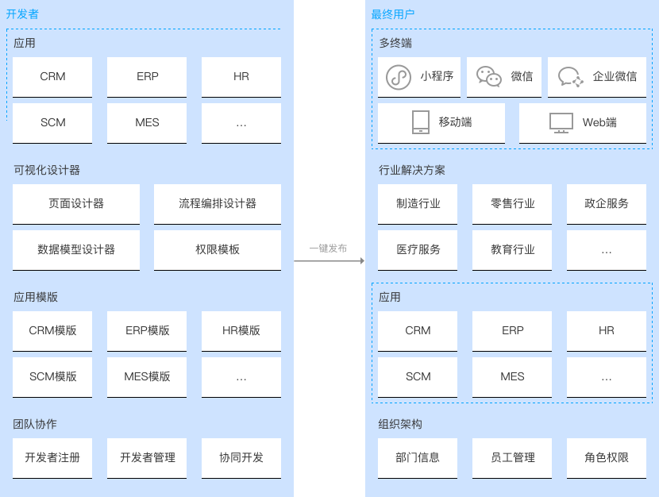
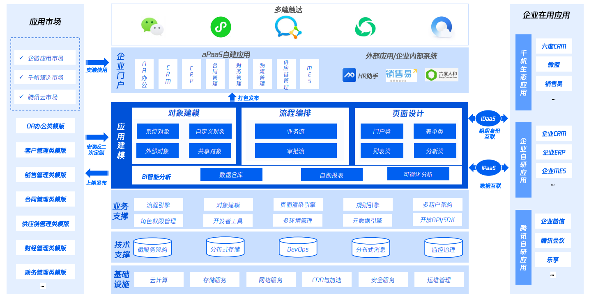

# 低代码究竟是什么

随着不同的用户诉求，一些系统衍生出新的形态，不同于既定的 SaaS 产品形态，用户可以通过可视化拖拽界面、表单配置等方式，快速定制出一个完整的应用，而且这一类系统基本不用编写太多的代码，即可以实现定制化应用。随着这一形态的系统越来越多，久而久之，大家就形象地称之为**低代码（low-code）**，另外也有人称之为 ”aPaaS“，即应用平台即服务。

## 低代码系统长什么样

虽然低代码平台的形态很多，但是其中的核心还是脱离不开编程思想，基本都有以下功能模块：页面搭建、数据逻辑、数据模型，在线部署和管理系统。根据不同的业务场景，具体的平台形态分化为表单/数据模型驱动、界面驱动等形态。

### 表单/数据模型驱动

表单/数据模型驱动是围绕数据结构来定义整个应用的形态和流程，其中表单驱动指用户通过配置表单界面，元素大多是文本输入、下拉选择器、日期选择器等组件，配置表单界面后自动生成数据模型，并基于该表单做数据及流程管理，而数据模型驱动则更复杂，需要用户进行数据建模和定义模型关系，此操作和 SQL 数据库搭建类似，配置主键、索引，类型等等，然后基于该数据表单搭建上层的管理系统。该模式比较多应用在搭建 CRM、ERP 等管理系统。

### 界面驱动

界面驱动比较好理解，就是用户通过拖拽组件方式可视化搭建界面，然后配置页面的交互逻辑，比如页面的跳转、数据获取等等。这种形式大多应用在搭建通用程序的低代码平台

## 低代码怎么做个性化定制

这里有同学会问了，低代码平台怎么满足个性化需求？诚然，受限于低代码平台所提供的组件和逻辑配置表单，只能解决一些通用化场景，当用户的诉求超脱出这个圈圈时，是不是就无能为力了？商业公司肯定不会这么幼稚，以下简单列举搜集到的一些个性化定制的方法：

- 用户可以在平台定制的规则下录入组件
- 提供 API 访问数据库
- 生成源代码做二次开发（低代码变代码了...）
- 填写反馈等平台更新

## 低代码有没有用？

- 一个可以降低门槛，提高效率的工具有没有用，这个问题本身就是一个伪命题，当然有用，只是程度的问题。**低代码平台的宗旨，不就是“降低门槛”，“降本增效”么。**，主要看低代码平台的业务边界在哪？举例通用场景：表单问卷、活动落地页、后台管理系统、

- 基于某个特定场景开发的低代码/无代码：基于营销活动的海报宣传页、基于运营人员的活动页、基于商家快速生成商城、OA办公系统、CRM、ERP、BI、数据可视化等等

### apaas平台架构

### 神笔产品架构

